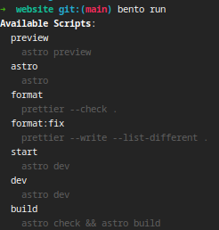

# Bento - A home-made npm package manager

Bento is a lightweight, Rust-based package manager that's fully compatible with
NPM. The current version supports core package management features including:

- Installing dependencies into a nested `node_modules` directory
- Creating a `.bin` folder for executable scripts
- Basic project management capabilities

While the implementation is currently in its early stages, Bento successfully
manages basic projects, including Vite + TypeScript setups.

## Installation

Currently, Bento can be installed directly from the GitHub repository. To
install:

1. Ensure you have Rust installed on your system
2. Run the following command:

```bash
cargo install --git https://github.com/morr0ne/bento.git
```

Note: Pre-built releases will be available in future versions.

## Usage

### Installing Dependencies

To install project dependencies, navigate to your project directory and run:

```bash
bento install
```

### Running Scripts

To execute project scripts:

```bash
bento run <script>
```

Running `bento` without arguments will display all available commands.

### Example Usage

Here's Bento running in an Astro project:



## Roadmap

### Current Limitations

The current implementation uses a simplified approach that may not handle
complex dependency structures. Known limitations include:

- Basic dependency resolution
- Limited error handling
- Minimal caching

### Upcoming Features

- Complete rewrite with proper dependency graph construction
- Advanced caching system
- Improved error handling and reporting
- Enhanced compatibility with complex Node.js projects

Most of this features are already done in a rewrite that will soon be published.

### Long-Term Vision

- Create a fully independent package manager that doesn't require Node.js or
  JavaScript
- Potential integration with an upcoming JavaScript runtime (to be announced)

## Contributing

While the project is in early development, contributions and feedback are
welcome. Please feel free to open issues or submit pull requests on GitHub.

## License

This project is licensed under the
[Apache License 2.0](http://www.apache.org/licenses/LICENSE-2.0). For more
details, see the [LICENSE](LICENSE) file.
